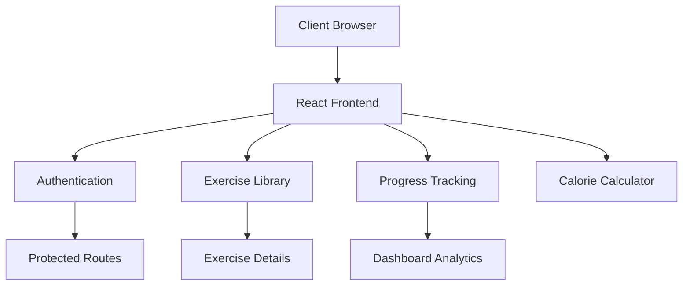
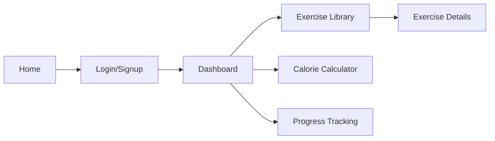
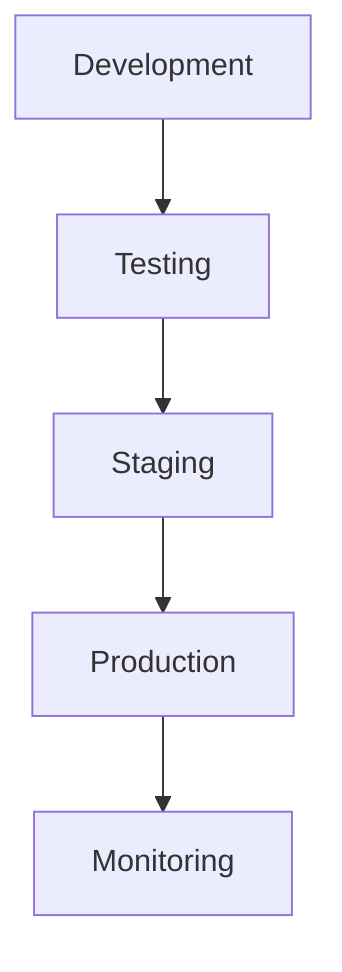

# Fitness Website Project Documentation

Supervised by:
[Your Supervisor's Name]

Team Members:
[Your Team Members' Names]

1 | Page

## Acknowledgement

We would like to extend our sincere gratitude to [Supervisor's Name] for their invaluable guidance and support throughout the development of our Fitness Website project. Their expertise and mentorship have been instrumental in helping us create a comprehensive fitness platform that combines modern technology with effective workout solutions.

Their dedication to fostering innovation and attention to detail has significantly contributed to the success of this project. We are particularly thankful for their insights in implementing user authentication, exercise tracking, and responsive design principles that have made our platform both functional and user-friendly.

2 | Page

## Abstract

The Fitness Website project is a comprehensive web application designed to help users track their fitness journey, manage workouts, and monitor calorie intake. The platform features a modern, responsive interface that provides users with tools to track exercises, monitor progress, and maintain their fitness goals.

Key functionalities include user authentication (signup/login), a personalized dashboard with progress tracking, an extensive exercise library with detailed instructions, and a calorie calculator. The platform also includes features like workout task management, progress visualization through charts, and a responsive design that works seamlessly across all devices.

The project is developed using React for the frontend, with Tailwind CSS for styling and Framer Motion for animations. The backend integration uses a RESTful API architecture, with secure user authentication and data persistence. The application emphasizes user experience with intuitive navigation and real-time progress updates.

3 | Page

## Table of Contents

1. Project Planning & Management
   1.1. Project Proposal
   1.2. Project Plan
   1.3. Task Assignment & Roles
   1.4. Risk Assessment & Mitigation Plan
   1.5. KPIs (Key Performance Indicators)

2. Technical Implementation
   2.1. Architecture Overview
   2.2. Technology Stack
   2.3. Features & Functionality
   2.4. Security Implementation

3. User Interface & Experience
   3.1. Design Philosophy
   3.2. Navigation Flow
   3.3. Responsive Design
   3.4. Accessibility Considerations

4. Core Features
   4.1. User Authentication
   4.2. Exercise Library
   4.3. Progress Tracking
   4.4. Calorie Calculator
   4.5. Dashboard Analytics

5. Testing & Quality Assurance
   5.1. Testing Strategy
   5.2. Test Cases
   5.3. Performance Optimization
   5.4. Bug Tracking & Resolution

6. Deployment & Maintenance
   6.1. Deployment Process
   6.2. Monitoring & Logging
   6.3. Backup & Recovery
   6.4. Update Strategy

7. Future Enhancements
   7.1. Planned Features
   7.2. Scalability Considerations
   7.3. User Feedback Integration

8. Conclusion
   8.1. Project Summary
   8.2. Lessons Learned
   8.3. Recommendations

4 | Page

## 1. Project Planning & Management

### 1.1. Project Proposal

The Fitness Website project aims to create a comprehensive platform for fitness enthusiasts to track their workouts, monitor progress, and maintain their health goals. The platform addresses the growing need for digital fitness solutions that combine exercise tracking, progress monitoring, and nutritional guidance.

**Objectives:**
- Create a user-friendly fitness tracking platform
- Implement secure user authentication
- Provide detailed exercise information and instructions
- Enable progress tracking and visualization
- Integrate calorie calculation and monitoring

### 1.2. Project Plan

The project was executed in multiple phases:

**Phase 1: Foundation**
- Setup development environment
- Implement basic UI components
- Create user authentication system

**Phase 2: Core Features**
- Develop exercise library
- Implement dashboard functionality
- Create progress tracking system

**Phase 3: Enhancement**
- Add calorie calculator
- Implement data visualization
- Optimize performance and responsiveness

### 1.3. Task Assignment & Roles

[Detail team member roles and responsibilities here]

### 1.4. Risk Assessment & Mitigation Plan

**Identified Risks:**
1. Data Security
   - Mitigation: Implement secure authentication
   - Use protected routes
   - Secure data storage

2. Performance
   - Mitigation: Optimize component rendering
   - Implement lazy loading
   - Use efficient state management

3. User Adoption
   - Mitigation: Intuitive UI/UX design
   - Comprehensive documentation
   - Regular user feedback integration

5 | Page

## 2. Technical Implementation

### 2.1. Architecture Overview

The application follows a modern React-based architecture with the following key components:



### 2.2. Technology Stack

**Frontend:**
- React.js
- Tailwind CSS
- Framer Motion
- React Router
- Recharts

**Development Tools:**
- Vite
- TypeScript
- ESLint
- Git

6 | Page

## 3. User Interface & Experience

### 3.1. Design Philosophy

The website follows a modern, minimalist design philosophy with emphasis on:

- Dark theme with red accents (#FF0000) for brand identity
- Clean, intuitive navigation
- Responsive layouts for all devices
- Animated transitions for better user engagement
- Clear visual hierarchy and content organization

### 3.2. Navigation Flow



### 3.3. Responsive Design

The application implements a mobile-first approach with:

- Flexible grid layouts using Tailwind CSS
- Breakpoint-specific styling
- Collapsible navigation for mobile devices
- Touch-friendly interface elements
- Optimized content display for different screen sizes

### 3.4. Accessibility Considerations

- ARIA labels for interactive elements
- Keyboard navigation support
- Color contrast compliance
- Screen reader compatibility
- Focus management for modals and popups

7 | Page

## 4. Core Features

### 4.1. User Authentication

**Implementation Details:**
- Secure JWT-based authentication
- Protected routes for authenticated content
- Password validation and security measures
- Social login integration (Google, GitHub)
- Password reset functionality

**Code Example (Protected Route):**
```typescript
const ProtectedRoute = ({
  isAllowed,
  redirectPath,
  children,
}: IProps) => {
  if (!isAllowed) {
    return <Navigate to={redirectPath} replace />;
  }
  return children;
};
```

### 4.2. Exercise Library

**Features:**
- Categorized exercise database
- Animated exercise demonstrations (GIFs)
- Detailed instructions and tips
- Body part filtering
- Search functionality

**Exercise Categories:**
- Strength Training
- Cardio
- Flexibility
- Core Workouts
- Full Body

### 4.3. Progress Tracking

**Dashboard Metrics:**
- Daily/Weekly progress visualization
- Workout completion rates
- Calorie tracking
- Activity history
- Performance trends

8 | Page

## 5. Testing & Quality Assurance

### 5.1. Testing Strategy

**Testing Levels:**
1. Unit Testing
   - Component testing
   - Utility function testing
   - State management testing

2. Integration Testing
   - API integration tests
   - Route navigation tests
   - Authentication flow tests

3. End-to-End Testing
   - User journey testing
   - Cross-browser compatibility
   - Mobile responsiveness

### 5.2. Test Cases

**Critical Test Scenarios:**
- User authentication flows
- Exercise data fetching and display
- Progress tracking accuracy
- Calorie calculator functionality
- Form validation and submission

### 5.3. Performance Optimization

**Implemented Optimizations:**
- Code splitting and lazy loading
- Image optimization
- Caching strategies
- Bundle size optimization
- API response caching

9 | Page

## 6. Deployment & Maintenance

### 6.1. Deployment Process

**Deployment Pipeline:**


### 6.2. Monitoring & Logging

**Monitoring Metrics:**
- User engagement
- Error rates
- Performance metrics
- API response times
- Resource utilization

### 6.3. Backup & Recovery

**Data Protection Measures:**
- Regular database backups
- Version control for code
- Environment configuration backups
- Recovery procedures documentation
- Incident response plan

10 | Page

## 7. Future Enhancements

### 7.1. Planned Features

1. Social Features
   - Workout sharing
   - Community challenges
   - Progress sharing

2. Advanced Analytics
   - Personalized recommendations
   - AI-powered workout plans
   - Progress predictions

3. Integration Capabilities
   - Fitness device integration
   - Nutrition tracking
   - Sleep monitoring

### 7.2. Scalability Considerations

**Scaling Strategies:**
- Microservices architecture
- Cloud infrastructure
- Load balancing
- Database optimization
- Caching implementation

11 | Page

## 8. Conclusion

### 8.1. Project Summary

The Fitness Website project successfully delivers a comprehensive platform for fitness tracking and workout management. The implementation of modern technologies and user-centric design principles has resulted in a robust and scalable solution.

### 8.2. Lessons Learned

1. Technical Insights
   - Importance of proper state management
   - Value of component reusability
   - Need for comprehensive testing
   - Performance optimization techniques

2. Project Management
   - Agile methodology benefits
   - Communication importance
   - Documentation significance
   - Risk management strategies

### 8.3. Recommendations

1. Technical Recommendations
   - Regular security audits
   - Continuous performance monitoring
   - Regular dependency updates
   - Code quality maintenance

2. Feature Recommendations
   - Enhanced social features
   - Mobile app development
   - Advanced analytics integration
   - Expanded exercise library

12 | Page

## Appendix

### A. API Documentation
### B. Database Schema
### C. Testing Reports
### D. User Feedback
### E. Performance Metrics 